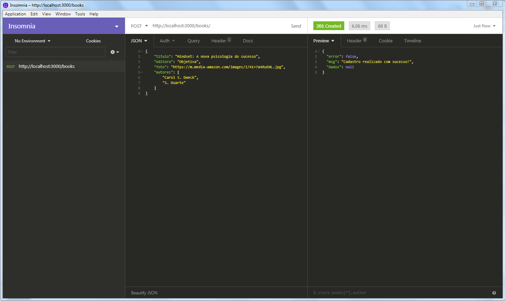
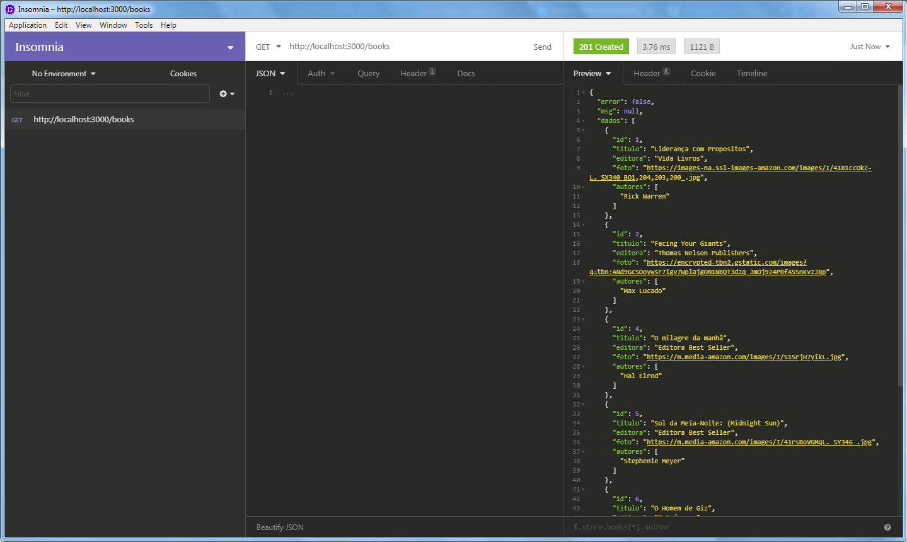
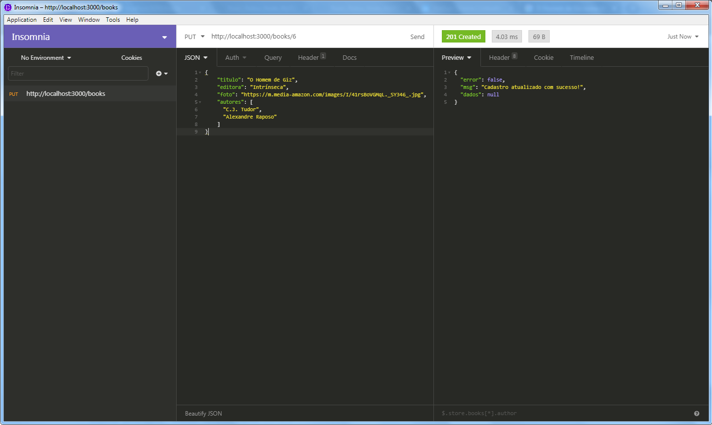
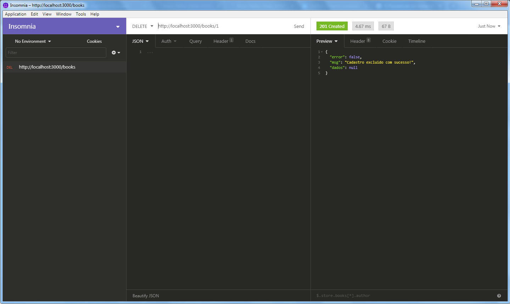

# Desafio - Biblioteca Devchallenge :rocket:
O desafio é desenvolver o back-end de uma biblioteca contendo às quatro operações do CRUD: Create (Criação), Read (Consulta), Update (Atualização) e Delete (Destruição).

O desafio encontra-se disponível nesse <a href="https://github.com/devchallenge-io/biblioteca-backend">link</a>.

# Techs:
- NodeJS
- TypeScript
- Express
- PostgreSQL
- Babel

## Rotas da aplicação:
### <b>[POST] </b> /books  

### <b>[GET] </b> /books/

### <b>[PUT] </b> /books/:id:

### <b>[DELETE] </b> /books/:id:

